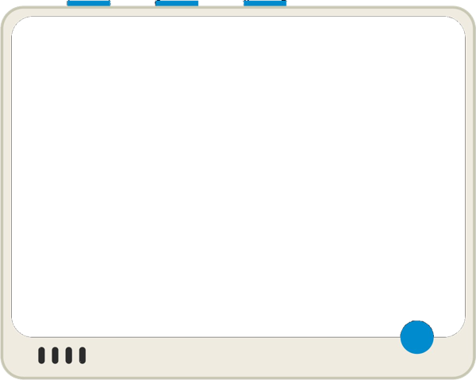

# tinygo-wio-terminal-emulator

A desktop emulator for TinyGo + Wio Terminal that speeds up your development cycle.
Preview display output and button input without flashing to the device.



## Features

- Install with a single `go install` command
- **No changes required** to your tinygo-playground code
- GUI based on the actual Wio Terminal device image
- Buttons (A/B/C) and joystick controllable via mouse or keyboard
- Hot reload support with `entr`

## Installation

```bash
go install github.com/kurakura967/tinygo-wio-terminal-emulator/cmd/wio-emu@latest
```

## Usage

```bash
# Preview
wio-emu path/to/main.go

# Hot reload (requires entr)
find path/to/project -name '*.go' | entr -r wio-emu path/to/main.go
```

### Example

```bash
wio-emu ../tinygo-playground/display/main.go
```

## Button Controls

| Button           | Mouse | Keyboard |
|------------------|-------|----------|
| A                | Click | Z        |
| B                | Click | X        |
| C                | Click | C        |
| Joystick press   | Click | Enter    |
| Joystick up      | —     | ↑        |
| Joystick down    | —     | ↓        |
| Joystick left    | —     | ←        |
| Joystick right   | —     | →        |

> As on real hardware, `machine.Pin.Get()` returns `false` when a button is pressed (active-low).

## Supported TinyGo Packages

| Package | Stub |
|---------|------|
| `machine` | SPI, Pin, LCD pin constants, button constants |
| `tinygo.org/x/drivers/ili9341` | DrawPixel, FillRectangle, FillScreen, SetPixel |
| `tinygo.org/x/tinyfont` | Works as-is (compatible with desktop Go) |

## How It Works

1. Rewrites imports in the given `.go` file using Go AST (`machine` → emulator stubs, etc.)
2. Generates a temporary project and compiles it with `go build`
3. Renders the 320×240 LCD buffer using Ebitengine

## Requirements

- macOS (Apple Silicon / Intel)
- Go 1.25 or later

## License

MIT
